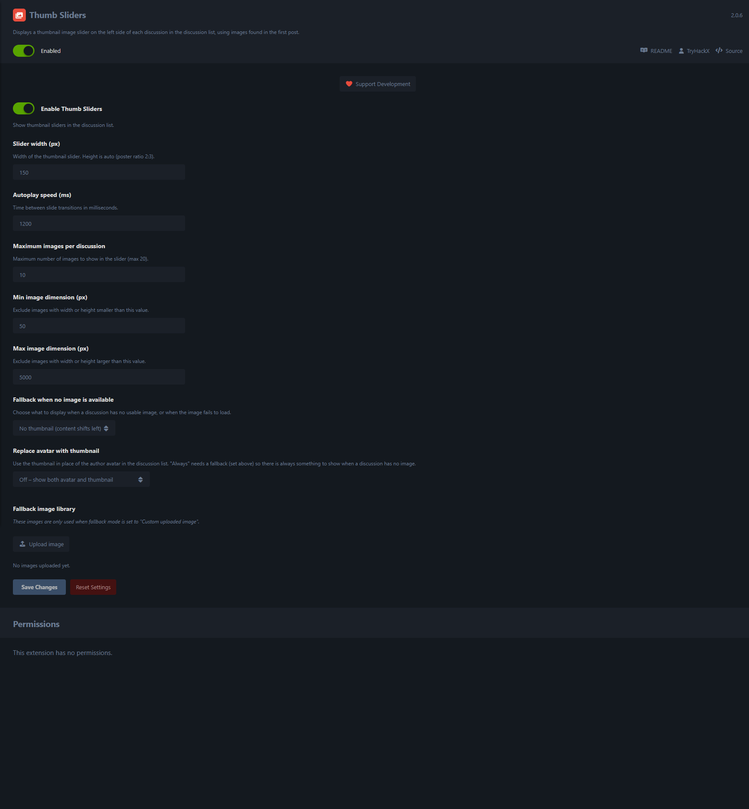
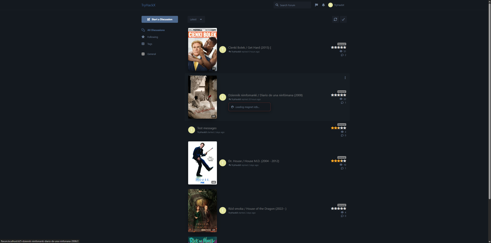

# Thumb Sliders for Flarum

A Flarum extension that displays an animated thumbnail image slider on the
left side of each discussion in the discussion list. Images are automatically
extracted from the first post content.

> **Latest:** Optional **avatar replacement** mode — let the thumbnail take
> the place of the author avatar on the list (off / when-image-present /
> always). Ships a shared **restructured layout module** (mirrored with
> `flarum-topic-rating`) that replaces the old absolute-position lattice
> with a clean flex/grid row: `[thumb] [avatar] [title + info] [meta]`,
> with the meta column adapting to whatever extensions are active
> (tags, rating, FoF discussion-views, replies).

> **Note:** Recent updates target the **2.x** line only. The **1.x** branch
> (Flarum 1.8+) is **no longer actively developed** — it stays available
> for legacy installs but won't receive new features.

## Features

- **Automatic image extraction** — Detects images from the first post via
  fast XML parsing of the s9e/TextFormatter format, with HTML rendering
  fallback. Supports standard `` tags and `fof/upload` `<UPL>` tags.
- **Smooth fade + scale animation** — Slick-style carousel with fade
  transitions and a subtle zoom (`scale(1.2)` → `scale(1)`), pure CSS.
- **Lazy loading with IntersectionObserver** — Slider loads its first
  image only when it enters the viewport; subsequent slides are
  pre-loaded in the background for seamless playback.
- **Configurable fallback** — When the first post has no usable image you
  can show nothing, a built-in placeholder, or your own uploaded image.
- **Avatar replacement** *(new)* — Optionally hide the author avatar when
  the thumbnail (or its fallback) takes its place. *"Always"* requires
  a fallback to be set so the row is never left empty; the layout
  degrades gracefully if you forget.
- **Shared layout module** — Drops a clean flex/grid layout for
  `DiscussionListItem` and a right-side meta column that hosts tags,
  rating, FoF views and replies. Mirrored with `flarum-topic-rating` so
  installing either gives you the same layout; foreign tags / FoF views
  are extracted from their ItemList contributions and re-placed by key.
- **Mobile-friendly** — Smaller thumb (56px), tighter paddings, no more
  pixel-perfect `top:` / `right:` offsets to break when extensions move.
- **Dark mode support** — Adapts background and shadow.
- **Image filtering** — Configurable minimum / maximum dimension filters;
  emojis, avatars, favicons and SVGs are excluded automatically.
- **Admin panel settings** — Full control over slider behaviour without
  touching code.

## Settings

| Setting | Default | What it does |
| --- | --- | --- |
| **Enable Thumb Sliders** | On | Master switch. |
| **Slider width** | 150 px | Width of the slider (50–400). Height follows 2:3 poster ratio. |
| **Autoplay speed** | 1200 ms | Time between slide transitions (500–10000). |
| **Max images per discussion** | 10 | Up to 20. |
| **Min image dimension** | 50 px | Skip images smaller than this. |
| **Max image dimension** | 5000 px | Skip images larger than this. |
| **Fallback when no image is available** | No thumbnail | One of: no thumbnail / built-in placeholder / custom uploaded image. |
| **Replace avatar with thumbnail** *(new)* | Off | *Off* — show both. *Replace when image present* — hide avatar only when a real extracted image exists. *Always* — always hide avatar (needs a fallback so the row isn't empty; falls back to keeping the avatar if no thumb at all). |

## Screenshots


*Mobile view — discussion list rendered with different combinations of TryHackX extensions (thumbnails + ratings + views, thumbnails + views, thumbnails only, ratings only, views only, vanilla Flarum).*



*Thumb Sliders admin panel — master switch, slider width / autoplay speed, max images per discussion, min / max image dimensions, fallback when no image is available, avatar-replacement mode and the fallback image library.*


*Desktop discussion list with the full TryHackX stack — the thumbnail slider sits on the left, star ratings on the right, with the magnet button next to each topic title.*



*Desktop discussion list — hover state showing the magnet tooltip loading inline; the shared layout module keeps the thumb / avatar / title / meta columns from overlapping.*

## Support Development

If you find this extension useful, consider supporting its development:

- **Monero (XMR):** `45hvee4Jv7qeAm6SrBzXb9YVjb8DkHtFtFh7qkDMxS9zYX3NRi1dV27MtSdVC5X8T1YVoiG8XFiJkh4p9UncqWGxHi4tiwk`
- **Bitcoin (BTC):** `bc1qncavcek4kknpvykedxas8kxash9kdng990qed2`
- **Ethereum (ETH):** `0xa3d38d5Cf202598dd782C611e9F43f342C967cF5`

You can also find the donation option in the extension's admin settings panel.

## Compatibility

| Flarum version | Extension version | Branch |
| --- | --- | --- |
| `^1.8` | `1.x` | [`flarum-1`](https://github.com/TryHackX/flarum-thumb-sliders/tree/flarum-1) |
| `^2.0` | `2.x` | [`main`](https://github.com/TryHackX/flarum-thumb-sliders/tree/main) / [`flarum-2`](https://github.com/TryHackX/flarum-thumb-sliders/tree/flarum-2) |

### Plays well with

- [**tryhackx/flarum-topic-rating**](https://github.com/TryHackX/flarum-topic-rating) — Star rating slots into the right meta column.
- [**tryhackx/flarum-magnet-link**](https://github.com/TryHackX/flarum-magnet-link) — Magnet tooltip integrates without overlapping.
- [**fof/discussion-views**](https://github.com/FriendsOfFlarum/discussion-views) — View counter sits between rating and replies in the meta column.
- `flarum/tags` — Tag labels (including floating-tags) are relocated to the top of the meta column.

## Installation

```bash
composer require tryhackx/flarum-thumb-sliders
php flarum cache:clear
```

## Updating

```bash
composer update tryhackx/flarum-thumb-sliders
php flarum cache:clear
```

## Configuration

1. Navigate to the **Administration** panel.
2. Find **Thumb Sliders** and enable it.
3. Click the extension to configure slider width, autoplay speed, image
   limits, dimension filters, fallback image, and the avatar replacement
   mode.

## How the layout module works

The shared module overrides `DiscussionListItem.contentView()`. Inside,
it still calls `this.contentItems()`, `this.infoItems()` and
`this.statsItems()`, so any extension's contributions still flow in — it
just pulls known keys out (`thumbSlider`, `rating`, `discussion-views`,
`tags`) and lays them out in a clean structure. The override installs
idempotently (a single global guard) regardless of whether *Thumb
Sliders* or *Topic Rating* loads first, so the two never compete.

## Links

- [GitHub](https://github.com/TryHackX/flarum-thumb-sliders)
- [Packagist](https://packagist.org/packages/tryhackx/flarum-thumb-sliders)
- [Report Issues](https://github.com/TryHackX/flarum-thumb-sliders/issues)

## License

MIT License. See [LICENSE](LICENSE) for details.
